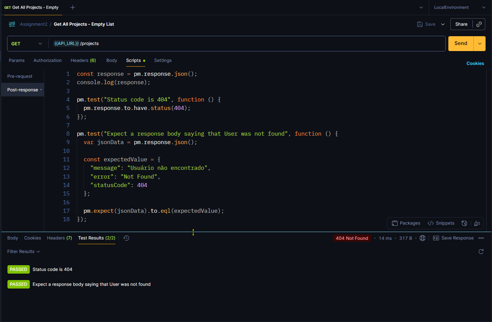

# Sobre esse repositório

Repositório contendo as atividades da disciplina Arquitetura de Aplicações com Node.Js - professor Samuel Martins da Silva, parte integrante do curso de Especialização em Arquitetura de Software Distribuído, oferta 9, turma 1, PUC Minas 2025.

# Setup do ambiente de desenvolvimento

## Configuração do arquivo .gitattributes

[CRLF vs. LF: Normalizing Line Endings in Git](https://www.aleksandrhovhannisyan.com/blog/crlf-vs-lf-normalizing-line-endings-in-git/)

```shell
echo > .gitattributes
```

## Verificação da versão do Node.JS

Checar a versão ativa do Node.JS

```shell
node --version
# v24.5.0 (latest version)
```

Checar as versões instaladas usando o nvm:

```shell
nwm ls
#        v22.18.0
# ->      v24.5.0
# default -> node (-> v24.5.0)
# iojs -> N/A (default)
# unstable -> N/A (default)
# node -> stable (-> v24.5.0) (default)
# stable -> 24.5 (-> v24.5.0) (default)
# lts/* -> lts/jod (-> v22.18.0)
# lts/argon -> v4.9.1 (-> N/A)
# lts/boron -> v6.17.1 (-> N/A)
# lts/carbon -> v8.17.0 (-> N/A)
# lts/dubnium -> v10.24.1 (-> N/A)
# lts/erbium -> v12.22.12 (-> N/A)
# lts/fermium -> v14.21.3 (-> N/A)
# lts/gallium -> v16.20.2 (-> N/A)
# lts/hydrogen -> v18.20.8 (-> N/A)
# lts/iron -> v20.19.4 (-> N/A)
# lts/jod -> v22.18.0
```

Configurar o alias default para apontar para a versão LTS:

```shell
nvm alias default 22.18.0
```

Mudar para a última versão LTS instalada (LTS = suporte de longa duração) usando o `nvm`

```shell
nvm use default
```

Comandos adicionados ao arquivo `.bashrc` para evitar digitá-los a cada nova instância do bash criada:

```file
nvm alias default 22.18.0
nvm use default
node -v
```

### Instalação do nest cli globalmente

```shell
npm i -g @nestjs/cli
```

### Criação do projeto

```shell
nest new project-manager-api
# selected npm as package manager
```

### Pós-criação

Após a criação do projeto, os arquivos da pasta `project-manager-api` foram movidos para a raiz do repositório e a pasta `project-manager-api` foi removida. Com isso, o script para executar o projeto recém-criado foi alterado, removendo a necessidade de alterar o diretório do shell.

```shell
mv ./project-manager-api/* ./
rm -r ./project-manager-api
```

### Execução do projeto novo

```shell
npm run start
# npm run start:dev - to watch files
```

### Criação de estrutura de pastas para a arquitetura limpa usando domain driven design

```shell
# Create folders
mkdir src/domain
mkdir src/domain/entities
mkdir src/domain/interfaces
mkdir src/domain/use-cases
mkdir src/domain/use-cases/projects
mkdir src/domain/use-cases/tasks
mkdir src/domain/use-cases/users
mkdir src/gateways
mkdir src/gateways/controllers
mkdir src/gateways/controllers/projects
mkdir src/gateways/controllers/tasks
mkdir src/gateways/controllers/users
mkdir src/gateways/guards
mkdir src/infrastructure
mkdir src/infrastructure/auth
mkdir src/infrastructure/database
mkdir src/infrastructure/database/entities
mkdir src/infrastructure/database/repositories

# Add empty .gitignore in each one to preserve folder structure while no file is added
echo > src/domain/.gitignore
echo > src/domain/entities/.gitignore
echo > src/domain/interfaces/.gitignore
echo > src/domain/use-cases/.gitignore
echo > src/domain/use-cases/projects/.gitignore
echo > src/domain/use-cases/tasks/.gitignore
echo > src/domain/use-cases/users/.gitignore
echo > src/gateways/.gitignore
echo > src/gateways/controllers/.gitignore
echo > src/gateways/controllers/projects/.gitignore
echo > src/gateways/controllers/tasks/.gitignore
echo > src/gateways/controllers/users/.gitignore
echo > src/gateways/guards/.gitignore
echo > src/infrastructure/.gitignore
echo > src/infrastructure/auth/.gitignore
echo > src/infrastructure/database/.gitignore
echo > src/infrastructure/database/entities/.gitignore
echo > src/infrastructure/database/repositories/.gitignore
```

### Criação dos primeiros arquivos de código

```shell
# Controllers
echo > src/gateways/controllers/controller.module.ts
# [Controllers](https://docs.nestjs.com/controllers)
nest g controller gateways/controllers/projects
nest g controller gateways/controllers/tasks
nest g controller gateways/controllers/users

# Interfaces
echo > src/domain/interfaces/user.interface.ts
echo > src/domain/interfaces/task.interface.ts
echo > src/domain/interfaces/project.interface.ts

# Entities
echo > src/domain/entities/project.ts
echo > src/domain/entities/task.ts
echo > src/domain/entities/user.ts
```

# Atividade 2 - Arquitetura Clean

Instalação das dependências adicionais

```shell
# [TypeORM module for Nest](https://www.npmjs.com/package/@nestjs/typeorm)
# [TypeORM repository](https://github.com/nestjs/typeorm)

# [TypeORM is an ORM that can run in Node.js, Browser, Cordova, Ionic, React Native, NativeScript, Expo, and Electron platforms and can be used with TypeScript and JavaScript (ES2021)](https://www.npmjs.com/package/typeorm)
# [ORM for TypeScript and JavaScript](https://github.com/typeorm/typeorm)

# [Asynchronous, non-blocking SQLite3 bindings for Node.js](https://www.npmjs.com/package/sqlite3)
# [SQLite3 bindings for Node.js repository](https://github.com/TryGhost/node-sqlite3)

# [Allows use of decorator and non-decorator based validation. Internally uses validator.js to perform validation. Class-validator works on both browser and node.js platforms.](https://www.npmjs.com/package/class-validator)
# [Decorator-based property validation for classes.](https://github.com/typestack/class-validator)

# [Class-transformer allows you to transform plain object to some instance of class and versa](https://www.npmjs.com/package/class-transformer)
# [Decorator-based transformation, serialization, and deserialization between objects and classes.](https://github.com/typestack/class-transformer)

npm install --save @nestjs/typeorm typeorm sqlite3 class-validator class-transformer

# [Mapped Types module for Nest used by the @nestjs/graphql and @nestjs/swagger packages.](https://www.npmjs.com/package/@nestjs/mapped-types)
# [Configuration module for Nest framework (node.js) 🐺](https://github.com/nestjs/mapped-types)
npm install --save @nestjs/mapped-types
```

## Estrutura dos módulos

```shell
nest g module domain
nest g module domain/use-cases
nest g module domain/use-cases/projects
nest g module domain/use-cases/tasks
nest g module domain/use-cases/users
nest g module infrastructure
nest g module infrastructure/database
nest g module infrastructure/auth
nest g module gateways
```

## Casos de uso

```shell
nest g service domain/use-cases/projects/get-all-projects --flat
nest g service domain/use-cases/projects/get-project-by-id --flat
nest g service domain/use-cases/projects/create-project --flat

nest g service domain/use-cases/tasks/get-all-tasks --flat
nest g service domain/use-cases/tasks/get-task-by-id --flat
nest g service domain/use-cases/tasks/create-task --flat
nest g service domain/use-cases/tasks/update-task --flat

nest g service domain/use-cases/users/create-user --flat
nest g service domain/use-cases/users/get-user-by-id --flat
nest g service domain/use-cases/users/get-all-users --flat
```

## Repositórios

```shell
nest g service infrastructure/database/repositories/projects.repository --flat --no-spec
nest g service infrastructure/database/repositories/tasks.repository --flat --no-spec
nest g service infrastructure/database/repositories/users.repository --flat --no-spec
```

## Entidades

```shell
echo > src/infrastructure/database/entities/project.entity.ts
echo > src/infrastructure/database/entities/task.entity.ts
echo > src/infrastructure/database/entities/user.entity.ts
```

## Implementação dos repositórios

```shell
mkdir src/domain/repositories

# Interfaces
echo "import { DeepPartial } from 'typeorm';" > src/domain/repositories/projects-repository.interface.ts
echo "import { DeepPartial } from 'typeorm';" > src/domain/repositories/tasks-repository.interface.ts
echo "import { DeepPartial } from 'typeorm';" > src/domain/repositories/users-repository.interface.ts

# Implementations
echo "import { Injectable } from '@nestjs/common';" > src/infrastructure/database/repositories/projects.repository.service.ts
echo "import { DataSource, DeepPartial, Repository } from 'typeorm';" >> src/infrastructure/database/repositories/projects.repository.service.ts
echo >> src/infrastructure/database/repositories/projects.repository.service.ts
echo "@Injectable()" >> src/infrastructure/database/repositories/projects.repository.service.ts
echo "export class" >> src/infrastructure/database/repositories/projects.repository.service.ts

echo "import { Injectable } from '@nestjs/common';" > src/infrastructure/database/repositories/tasks.repository.service.ts
echo "import { DataSource, DeepPartial, Repository } from 'typeorm';" >> src/infrastructure/database/repositories/tasks.repository.service.ts
echo >> src/infrastructure/database/repositories/tasks.repository.service.ts
echo "@Injectable()" >> src/infrastructure/database/repositories/tasks.repository.service.ts
echo "export class" >> src/infrastructure/database/repositories/tasks.repository.service.ts


echo "import { Injectable } from '@nestjs/common';" > src/infrastructure/database/repositories/users.repository.service.ts
echo "import { DataSource, DeepPartial, Repository } from 'typeorm';" >> src/infrastructure/database/repositories/users.repository.service.ts
echo >> src/infrastructure/database/repositories/users.repository.service.ts
echo "@Injectable()" >> src/infrastructure/database/repositories/users.repository.service.ts
echo "export class" >> src/infrastructure/database/repositories/users.repository.service.ts
```

## Implementação dos casos de uso

```shell
mkdir src/gateways/controllers/projects/dtos
echo > src/gateways/controllers/projects/dtos/create-project.dto.ts
echo > src/gateways/controllers/projects/dtos/update-project.dto.ts

mkdir src/gateways/controllers/tasks/dtos
echo > src/gateways/controllers/tasks/dtos/create-task.dto.ts
echo > src/gateways/controllers/tasks/dtos/update-task.dto.ts

mkdir src/gateways/controllers/users/dtos
echo > src/gateways/controllers/users/dtos/create-user.dto.ts
echo > src/gateways/controllers/users/dtos/update-user.dto.ts
```

Interface para implementação dos casos de uso

```shell
echo > src/domain/use-cases/base-use-case.ts
```

## Testes da API implementada até a atividade 2 usando Postman e Newman

Instalação do newman usando a linha de comando

```shell
# https://learning.postman.com/docs/collections/using-newman-cli/installing-running-newman/
npm install -g newman
```

Instruções básicas de uso do newman

```shell
Usage: newman [options] [command]

Options:
  -v, --version               output the version number
  -h, --help                  display help for command

Commands:
  run [options] <collection>  Initiate a Postman Collection run from a given URL or path

To get available options for a command:
  newman <command> -h
```

Os arquivos do Postman foram organizados em Collections e Environments e um script global do PowerShell, chamado `Global.CollectionRunner.ps1` foi criado para executar todas as requisições de uma dada coleção de forma automatizada, permitindo salvar logs em arquivo para posterior avaliação.

Uma das possíveis formas de chamar esse script global é

```PowerShell
.\Global.CollectionRunner.ps1 -WriteLog yes -LocalEnvironment yes -Verbosity yes
```

Internamente ao script, chama-se um ou mais scripts do PowerShell para rodar cada coleção individual. No presente momento, há apenas um script `Assignment2.CollectionRunner.ps1` que executa toda a coleção Assignment em um comando similar ao apresentado abaixo:

```PowerShell
newman run "$($collectionFileName)" --insecure -e "../Environments/$($envFile)" --verbose | Out-File -FilePath "$($collectionName).log" -Encoding oem
```

e o sumário de uma execução bem sucedida é apresentado no arquivo `Collections\Assignment2.log` conforme mostrado abaixo:

```
┌─────────────────────────┬─────────────────────┬────────────────────┐
│                         │            executed │             failed │
├─────────────────────────┼─────────────────────┼────────────────────┤
│              iterations │                   1 │                  0 │
├─────────────────────────┼─────────────────────┼────────────────────┤
│                requests │                   9 │                  0 │
├─────────────────────────┼─────────────────────┼────────────────────┤
│            test-scripts │                   9 │                  0 │
├─────────────────────────┼─────────────────────┼────────────────────┤
│      prerequest-scripts │                   0 │                  0 │
├─────────────────────────┼─────────────────────┼────────────────────┤
│              assertions │                  18 │                  0 │
├─────────────────────────┴─────────────────────┴────────────────────┤
│ total run duration: 1201ms                                         │
├────────────────────────────────────────────────────────────────────┤
│ total data received: 831B (approx)                                 │
├────────────────────────────────────────────────────────────────────┤
│ average response time: 39ms [min: 8ms, max: 132ms, s.d.: 38ms]     │
├────────────────────────────────────────────────────────────────────┤
│ average DNS lookup time: 903µs [min: 903µs, max: 903µs, s.d.: 0µs] │
├────────────────────────────────────────────────────────────────────┤
│ average first byte time: 36ms [min: 6ms, max: 129ms, s.d.: 39ms]   │
└────────────────────────────────────────────────────────────────────┘
```

## Capturas de tela dos testes usando o Postman e registro do banco de dados

Após a inicialização da aplicação, sem arquivo prévio de banco de dados, foram realizadas requisições para a API usando o Postman e os resultados e testes embutidos no Postman serão apresentados a seguir. A Figura 1 mostra o estado da aplicação logo após o startup usando o comando `npm run start`:

**Figura 1:** Estado da aplicação após a inicialização


As primeiras três requisições ao banco visavam registrar o estado inicial do banco de dados - sem usuários, projetos e tarefas. As Figuras 2, 3, 4, 5, 6 e 7 mostram as requisições e os respectivos testes escritos em Javascript na interface do Postman - que podem ser conferidos diretamente na coleção [Assignment2.postman_collection.json](./Collections/Assignment2.postman_collection.json)

**Figura 2**: Requisição para retornar todos os usuários do banco - Banco de dados vazio


**Figura 3**: Requisição para retornar todos os usuários do banco - Testes


**Figura 4**: Requisição para retornar todos os projetos do banco - Banco de dados vazio


**Figura 5**: Requisição para retornar todos os projetos do banco - Testes


**Figura 6**: Requisição para retornar todas as tarefas do banco - Banco de dados vazio


**Figura 7**: Requisição para retornar todas as tarefas do banco - Testes


As próximas operações consistem da criação de um usuário (Figuras 8 e 9), um projeto para esse usuário (Figuras 12 e 13) e de uma tarefa (Figuras 16 e 17) para esse projeto e testes na própria requisição e requisição de GET por ID para checar a operação anterior de POST (Figuras 10 e 11 - Usuário; Figuras 14 e 15 - Projeto; Figuras 18 e 19 - Tarefas).

**Figura 8**: Criação de um usuário - Requisição


**Figura 9**: Criação de um usuário - Testes


**Figura 10**: Consulta de usuário pelo ID - Requisição


**Figura 11**: Consulta de usuário pelo ID - Testes


**Figura 12**: Criação de um projeto - Requisição


**Figura 13**: Criação de um projeto - Testes


**Figura 14**: Consulta de projeto pelo ID - Requisição


**Figura 15**: Consulta de projeto pelo ID - Testes


**Figura 16**: Criação de uma tarefa - Requisição


**Figura 17**: Criação de uma tarefa - Testes


**Figura 18**: Consulta de tarefa pelo ID - Requisição


**Figura 19**: Consulta de tarefa pelo ID - Testes


Por fim, requisições que devem retornar coleções - Usuários, Projetos e Tarefas - foram inseridas no final da coleção para uma verificação final da sua implementação. As Figuras 20 a 25 mostram os resultados dessas requisições

**Figura 20**: Requisição para retornar todos os usuários do banco - Banco de dados com 1 usuário inserido


**Figura 21**: Requisição para retornar todos os usuários do banco - Testes


**Figura 22**: Requisição para retornar todos os projetos do banco - Banco de dados com 1 projeto inserido


**Figura 23**: Requisição para retornar todos os projetos do banco - Testes


**Figura 24**: Requisição para retornar todas as tarefas do banco - Banco de dados com 1 tarefa inserida


**Figura 25**: Requisição para retornar todas as tarefas do banco - Testes


# Atividade 3 - Autenticação e Cache

## Estrutura da aplicação

### Pacotes adicionais - bcrypt, jwt, cache-manager e redis

Alguns pacotes adicionais serão instalados para essa parte da atividade 3. O comando original é apresentado abaixo, junto com os resultados que apontam conflitos com os pacotes instalados anteriormente.

```shell
# Original command

# [bcrypt](https://www.npmjs.com/package/bcrypt)
# [bcrypt repository](https://github.com/kelektiv/node.bcrypt.js)

# [Type definitions for bcrypt](https://www.npmjs.com/package/@types/bcrypt)
# [Repository with types for bcrypt](https://github.com/DefinitelyTyped/DefinitelyTyped/tree/master/types/bcrypt)

# [JWT utilities module for Nest based on the jsonwebtoken package](https://www.npmjs.com/package/@nestjs/jwt)
# [jwt repositories](https://github.com/nestjs/jwt)

# [cache-manager module for Nest originally published as part of the @nestjs/common package. This package is a drop-in replacement for the deprecated CacheModule](https://www.npmjs.com/package/@nestjs/cache-manager/v/2.3.0)
# [cache-manager module repository](https://github.com/nestjs/cache-manager#readme)

# [A cache module for nodejs that allows easy wrapping of functions in cache, tiered caches, and a consistent interface. This module is now part of the Cacheable project](https://www.npmjs.com/package/cache-manager/v/5.7.6)
# [Caching for Nodejs based on Keyv](https://github.com/jaredwray/cacheable#readme)

# [Redis cache store for node-cache-manager](https://www.npmjs.com/package/cache-manager-redis-store/v/2.0.0)
# [Redis cache store repository](https://github.com/dabroek/node-cache-manager-redis-store#readme)

# [Redis](https://www.npmjs.com/package/redis)
# [node-redis repository](https://github.com/redis/node-redis)

npm install --save bcrypt @types/bcrypt @nestjs/jwt @nestjs/cache-manager@2 cache-manager@5 cache-manager-redis-store@2 redis
```

```shell
# Results of original command - Redacted
npm error code ERESOLVE
npm error ERESOLVE unable to resolve dependency tree
npm error
npm error While resolving: project-manager-api@0.0.1
npm error Found: @nestjs/common@11.1.6
npm error node_modules/@nestjs/common
npm error   @nestjs/common@"^11.0.1" from the root project
npm error
npm error Could not resolve dependency:
npm error peer @nestjs/common@"^9.0.0 || ^10.0.0" from @nestjs/cache-manager@2.3.0
npm error node_modules/@nestjs/cache-manager
npm error   @nestjs/cache-manager@"2" from the root project
npm error
npm error Fix the upstream dependency conflict, or retry
npm error this command with --force or --legacy-peer-deps
npm error to accept an incorrect (and potentially broken) dependency resolution.
npm error
npm error
npm error For a full report see:
npm error {REDACTED}\npm-cache\_logs\2025-09-14T19_54_12_471Z-eresolve-report.txt
npm error A complete log of this run can be found in: {REDACTED}\npm-cache\_logs\2025-09-14T19_54_12_471Z-debug-0.log
```

Com o objetivo de resolver o conflito, tentar-se-á forçar a resolução de dependências.

```shell
# Modified command
npm install --save bcrypt @types/bcrypt @nestjs/jwt @nestjs/cache-manager@2 cache-manager@5 cache-manager-redis-store@2 redis --legacy-peer-deps
```

### Novos módulos de infraestrutura

Novos módulos serão criados conforme os comandos listados abaixo:

```shell
nest g module infrastructure/redis
nest g module infrastructure/auth # (it didn't have any impact due to commands executed before)
```

Um novo serviço será criado dentro da pasta `auth`:

```shell
nest g service infrastructure/auth/auth --flat
```

Criação de arquivo com constante para uso com o jwt:

```shell
echo > src/infrastructure/auth/constants.ts
```

### Caso de uso - Recuperar usuários por e-mail

O comando a ser executado é:

```shell
nest g service domain/use-cases/users/get-user-by-email --flat
```

### Criação de um guarda para controle da autenticação

O comando para criação do guard é:

```shell
nest g service gateways/guards/auth-guard --flat
```

### Criação de um controller para o login

O comando para criação do controller é:

```shell
nest g controller gateways/controllers/auth/auth --flat
```

### Criação de dtos para o login

O comando para criação dos dtos de login via linha de comando é:

```shell
echo > src/gateways/controllers/auth/dtos/login.dto.ts
```
